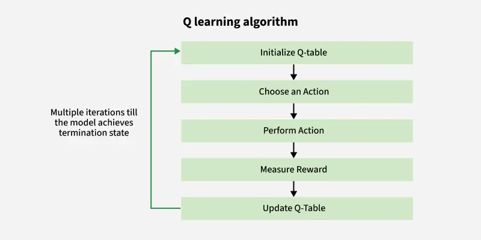
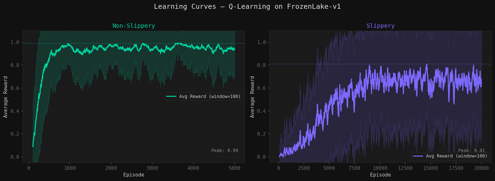
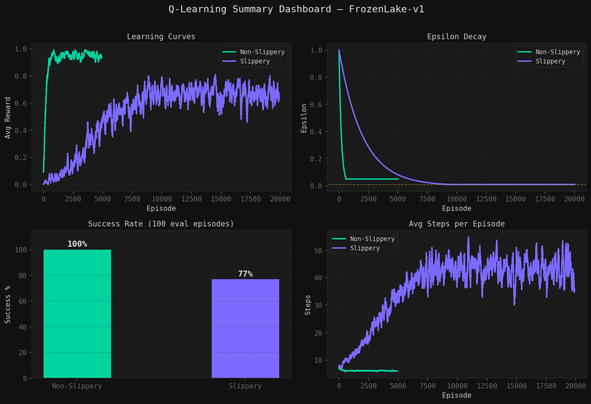

# Q-Learning on FrozenLake
A from-scratch implementation of **Tabular Q-Learning** (value-based, off-policy reinforcement learning) trained on OpenAI Gym's `FrozenLake-v1` environment, using only Python and NumPy.

The agent learns to navigate a frozen grid to reach a goal tile while avoiding holes, under both **deterministic (non-slippery)** and **stochastic (slippery)** dynamics. The project covers Q-table construction, epsilon-greedy action selection with decay, the Bellman update rule, hyperparameter tuning for stability, and a full evaluation/visualization pipeline.

---

## Project Structure

```
q-learning/
├── q_learning_frozenlake.ipynb   # Full implementation, training, and evaluation
├── report.pdf                    # 2-page written report with full visualizations and critical analysis
├── q_learning_algorithm.png      # Algorithm flowchart used in README
├── demo/                         # Supplementary visual demo (local, requires a display)
│   ├── frozen_lake_qviz.py       # Custom FrozenLake env with live Q-value overlay
│   └── watch_agent.py            # Trains agents and renders them playing
├── outputs/
│   ├── learning_curves.png       # Avg. reward vs. episodes (slippery vs non-slippery)
│   ├── epsilon_decay.png         # Exploration rate decay over training
│   ├── qTable_heatmap.png        # Learned state-value heatmap
│   ├── policy_arrows.png         # Greedy policy visualized on the grid
│   ├── state_visitation.png      # State visitation frequency during training
│   ├── summary_dashboard.png     # Combined results dashboard
│   └── logs.txt                  # Training/evaluation logs (final success rates)
└── README.md
```

---

## Background

**Reinforcement Learning (RL)** is a paradigm where an agent learns to make decisions by interacting with an environment and receiving feedback (rewards), rather than from labeled examples.

| Concept | Description |
|---|---|
| **Agent** | The learner/decision-maker |
| **Environment** | FrozenLake — a 4x4 grid world |
| **State (S)** | The agent's current tile |
| **Action (A)** | Move Up / Down / Left / Right |
| **Reward (R)** | +1 for reaching the goal, 0 otherwise |
| **Discount Factor (γ)** | Balances immediate vs. future rewards |

### The Bellman Update Rule

```
Q_new(s,a) = Q_old(s,a) + α [ R + γ · max(Q(s',a')) − Q_old(s,a) ]
```

The agent maintains a **Q-table** (states × actions) and updates it after every step using the equation above, gradually learning which action is best in each state.

### Exploration vs. Exploitation

The agent uses an **epsilon-greedy** strategy:
- With probability ε → explore (random action)
- With probability 1−ε → exploit (best known action)

ε decays over training, so the agent shifts from exploring the environment early on to exploiting its learned policy later.

---

## Implementation Details

- **Environment:** `FrozenLake-v1` (Gymnasium), tested in both `is_slippery=False` and `is_slippery=True` modes
- **Algorithm:** Tabular Q-Learning (off-policy, value-based)
- **Q-table:** Initialized and updated using NumPy arrays only — no deep learning, no backpropagation
- **Exploration:** Epsilon-greedy with exponential decay
- **Hyperparameters tuned separately** for slippery vs. non-slippery settings (learning rate α, discount factor γ, ε decay schedule, episode count) to handle the added stochasticity of slippery ice

---

## Results & Visualizations

### Learning Curves
Average reward per episode (with rolling average) for slippery vs. non-slippery training.



### Summary Dashboard
Combined overview of training metrics and final performance.



Additional plots (epsilon decay, Q-table heatmap, learned policy, state visitation) and full critical analysis are available in [`report.pdf`](report.pdf).

---

## Evaluation

Final success rate over the last 100 evaluation episodes (greedy policy, ε = 0) is recorded in [`outputs/logs.txt`](outputs/logs.txt).

---

## Visual Demo

The `demo/` folder contains a supplementary visualization tool that renders a trained agent playing FrozenLake with live Q-values shown on each tile, using `pygame`. It is intended for local inspection of the learned policy and is not part of the core training pipeline; it requires a display window, so it runs locally rather than in Colab.

```bash
cd demo
pip install gymnasium[toy-text] numpy pygame
python watch_agent.py
```

This trains both agents headlessly, then opens a window to watch the Non-Slippery agent play, followed by the Slippery agent, with the agent's chosen action shown as a direction arrow and the best-known action at each tile highlighted in bold. Use `1` / `0` / `-` / `=` to control playback speed and `ESC` to quit.

## How to Run

1. Open `q_learning_frozenlake.ipynb` in [Google Colab](https://colab.research.google.com/) or Jupyter
2. Run all cells top to bottom
3. Generated plots and logs will be saved to the `outputs/` directory

**Dependencies:** `gymnasium`, `numpy`, `matplotlib`

---

## Author

**Yonatan Azmir**
June 2026